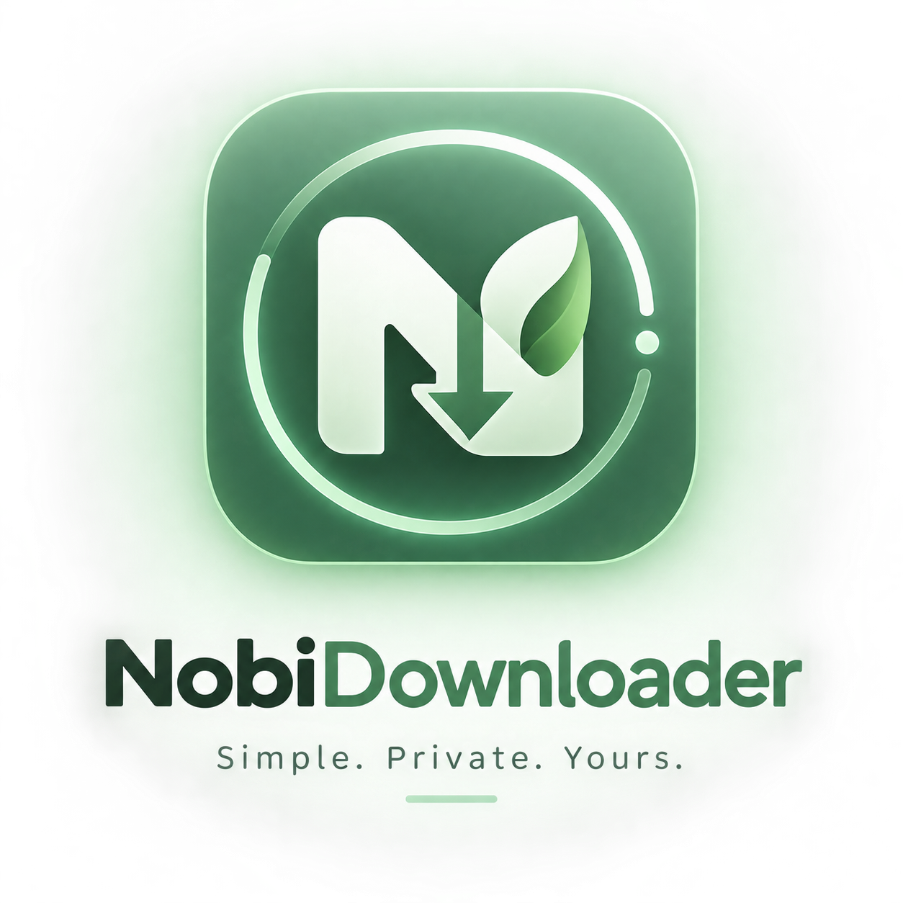
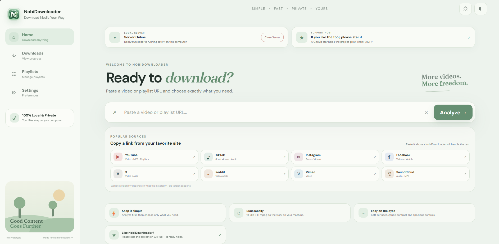

# NobiDownloader

<p align="center">
  
</p>

<h2 align="center">Simple. Private. Yours.</h2>

<p align="center">
  A calm, local-first media downloader powered by yt-dlp and FFmpeg.
</p>

<p align="center">
  <a href="https://github.com/NavajyotiBayan/NobiDownloader">⭐ Star on GitHub</a>
  ·
  <a href="https://github.com/NavajyotiBayan/NobiDownloader/issues">Report an Issue</a>
</p>

---

## 🌿 NobiDownloader

NobiDownloader makes downloading videos, playlists, and MP3s simple.

Everything runs locally on your Windows computer — paste a URL, choose your quality, and download.

<p align="center">
  
</p>

### ✨ Features

- 🎬 Video downloads up to 4K
- 🎵 MP3 downloads up to 320 kbps
- 📋 YouTube playlist support
- 🎚️ Simple quality ladder with smart fallback
- 📊 Real-time download progress
- 📁 Custom download location
- ⏹️ Cancel downloads anytime
- ✕ Cancel URL analysis
- 🌿 Calm, eye-comfort interface
- 🔒 Local & private
- 🛑 Close the server directly from the app
- 🔊 Subtle click feedback throughout the interface

---

## 🚀 Install

Open **PowerShell** and run:

```powershell
irm https://nobidownloader.navajyoti.online | iex
```

That's it.

The installer sets up NobiDownloader and its required runtime automatically.

After installation, open the **NobiDownloader** folder on your Desktop and run:

```text
Start.bat
```

The web app will open automatically in your browser.

---

## 🎯 How to use

**1. Copy a video or playlist URL**

Paste it into the NobiDownloader dashboard.

**2. Click Analyze**

NobiDownloader prepares the media information.

**3. Choose what you want**

Select:

```text
Best Available
360p
480p
720p
1080p
2K
4K
```

or switch to **Audio** for:

```text
128 kbps
192 kbps
256 kbps
320 kbps
```

**4. Download**

Choose your save location and start the download.

For playlists, NobiDownloader automatically keeps the videos organized inside a playlist folder.

---

## 🔒 Local & Private

NobiDownloader runs on your own computer.

Your downloaded files stay on your machine, and there is no NobiDownloader cloud service handling your media.

---

## 🌐 Supported Sources

NobiDownloader uses **yt-dlp**, so supported websites depend on the extractors available in the installed yt-dlp version.

Popular sources are available directly from the dashboard.

---

## ⚠️ Responsible Use

Only download content that you have the legal right or permission to download.

Please respect copyright, content licenses, and the terms of the websites you use.

---

## ⭐ Like NobiDownloader?

If you find NobiDownloader useful, please consider giving the project a ⭐ on GitHub.

It really helps the project grow.

<p align="center">
  <a href="https://github.com/NavajyotiBayan/NobiDownloader">
    ⭐ Star NobiDownloader
  </a>
</p>

---

<p align="center">
  <strong>NobiDownloader</strong><br>
  Simple. Private. Yours.
</p>
